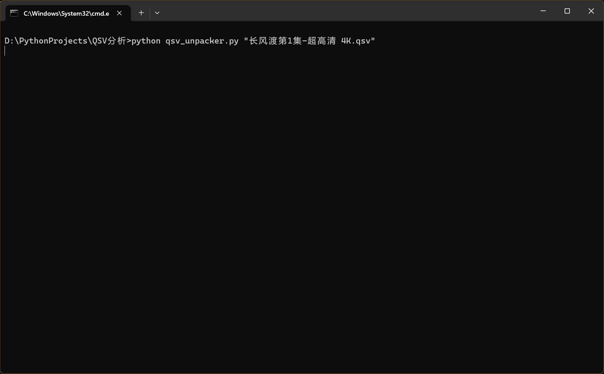

# qsv_unpacker
Unpack QSV file, output MPEGTS, JSON, M3U8 files

Tested version: latest (10.6.5.7073)

QSV Structure: https://github.com/btnkij/qsv2flv/tree/main/secret

**Note:** The exported TS file still need to be decrypted in order to get the clear file.

# requirements
```
pip install -r requirements.txt
```

# usage
```
python qsv_unpacker.py path_to_qsv.qsv
```

# screen

